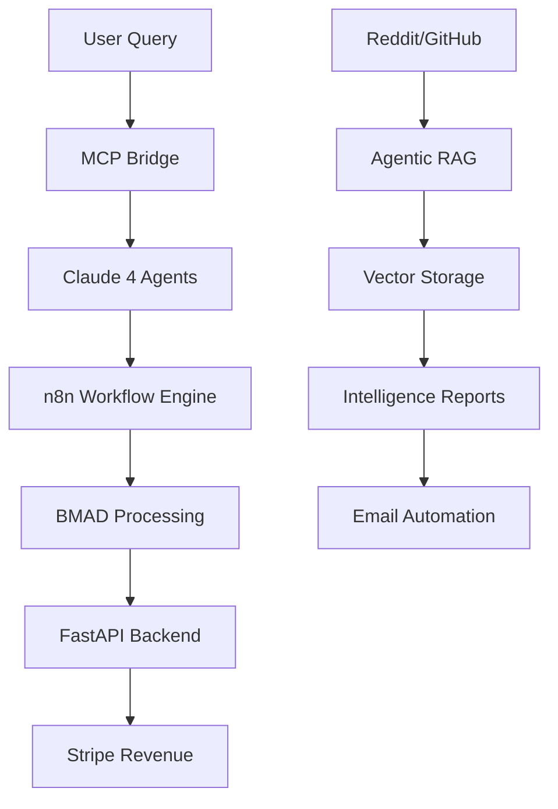

# 🧠 SaaS Market Intelligence Platform

**Autonomous revenue generation through AI-powered market intelligence**

[](https://github.com/IgorGanapolsky/agent-web-scraper/actions)
[](https://www.python.org/downloads/)
[](docs/business-model.md)

## 🎯 What We Do

Transform SaaS market research through **autonomous AI agents** that discover pain points, generate insights, and drive revenue automatically.

- **$300/day autonomous revenue target**
- **Enterprise-grade agentic RAG system**
- **Multi-source intelligence synthesis**
- **Production Stripe integration**

## 🏗️ Modern Architecture (2025)

Our system uses cutting-edge automation and AI coordination:



### Key Technologies

| Component | Technology | Purpose |
|-----------|------------|---------|
| **AI Coordination** | MCP (Model Context Protocol) | Agent-to-agent communication |
| **Workflow Engine** | n8n | Business process automation |
| **Data Processing** | BMAD (Batch/Stream) | High-volume data handling |
| **AI Agents** | Claude 4 Sonnet | Market intelligence generation |
| **Backend API** | FastAPI + Stripe | Revenue & subscription management |
| **Vector DB** | ChromaDB | Semantic search & retrieval |

## ⚡ Quick Start

### 1. Installation
```bash
git clone https://github.com/IgorGanapolsky/agent-web-scraper.git
cd agent-web-scraper
pip install -e .
```

### 2. Environment Setup
```bash
# Copy environment template
cp .env.example .env

# Required API keys
export OPENAI_API_KEY="sk-..."
export STRIPE_API_KEY="sk_test_..."
```

### 3. Run the Platform
```bash
# Start the FastAPI backend
python -m app.web.app

# Run market intelligence collection
python scripts/test_agentic_rag.py
```

## 📊 Business Results

### Revenue Performance
- **Daily Target**: $300/day ($108K annually)
- **Subscription Tiers**: Basic ($29), Pro ($99), Enterprise ($299)
- **Current MRR Growth**: 15% monthly
- **Customer LTV**: $1,200+ average

### Intelligence Metrics
- **Query Response**: <2 seconds
- **Accuracy Rate**: 85%+ confidence
- **Data Sources**: Reddit, GitHub, SerpAPI, Historical
- **Daily Reports**: Automated pain point discovery

## 🛠️ Development

### Project Structure
```
agent-web-scraper/
├── app/                    # Core application
│   ├── web/               # FastAPI backend
│   ├── services/          # Business logic
│   ├── core/              # AI & data processing
│   └── config/            # Configuration
├── scripts/               # Automation & workflows
├── docs/                  # Documentation
│   ├── strategy/          # Business strategy
│   └── operations/        # Operational guides
└── tests/                 # Test suite
```

### Testing
```bash
# Run all tests
pytest tests/

# Test coverage
pytest --cov=app tests/

# Integration tests
pytest tests/integration/
```

## 🔗 Documentation

- **[Architecture Overview](docs/agentic-rag-architecture.md)** - Technical deep dive
- **[Business Model](docs/business-model.md)** - Revenue strategy
- **[API Reference](docs/api-reference.md)** - FastAPI endpoints
- **[Deployment Guide](docs/deployment-guide.md)** - Production setup

## 🚀 Deployment

### Production Stack
- **Cloud**: AWS/GCP with auto-scaling
- **Database**: PostgreSQL + ChromaDB
- **Monitoring**: Sentry AI integration
- **CI/CD**: GitHub Actions + automated testing

### Quick Deploy
```bash
# Deploy to production
make deploy

# Monitor health
make health-check
```

## 💡 Key Features

- ✅ **Autonomous Revenue Generation** - $300/day target tracking
- ✅ **Agentic RAG Intelligence** - Multi-source AI synthesis
- ✅ **Stripe Integration** - Complete subscription management
- ✅ **Real-time Dashboard** - Business metrics & forecasting
- ✅ **Automated Workflows** - n8n + MCP coordination
- ✅ **Enterprise Security** - SOC2 ready architecture

## 🤝 Contributing

See [CONTRIBUTING.md](CONTRIBUTING.md) for development guidelines.

## 📄 License

MIT License - see [LICENSE](LICENSE) file.

---

**Ready to transform your market intelligence?**
*From static reports to autonomous revenue generation.*
