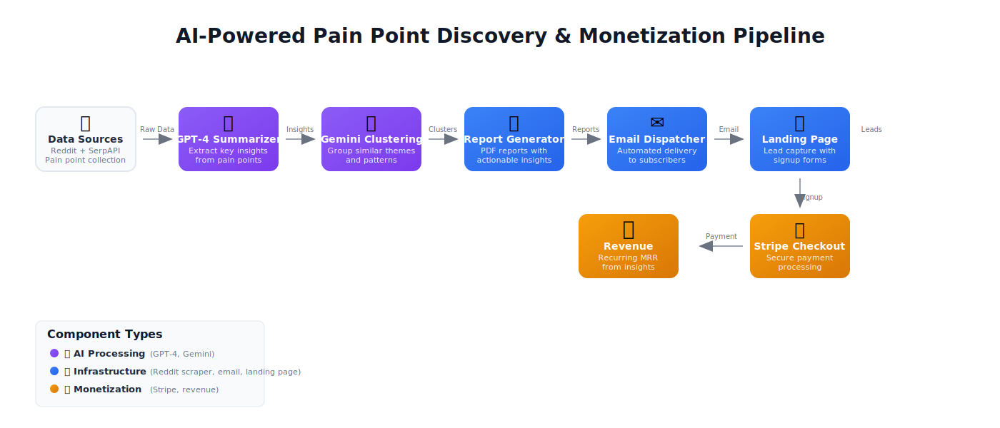
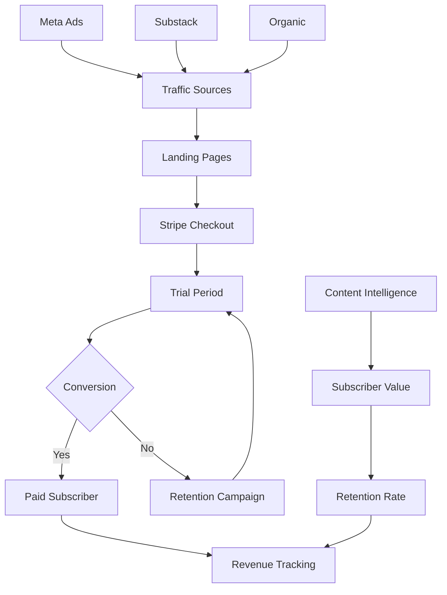

# SaaS Growth Dispatch Architecture Overview

## AI Orchestration System Architecture



Our autonomous revenue system leverages a sophisticated multi-agent architecture where each AI specializes in distinct business functions, coordinated through n8n workflows to achieve our $300/day profit target.

## Core Components

### 1. MCP (Model Context Protocol) Servers

The backbone of our AI coordination system, providing secure, standardized communication between agents:

- **Stripe MCP Server**: Handles payment processing, subscription management, and revenue tracking
- **Dashboard MCP Server**: Real-time metrics aggregation and business intelligence
- **GitHub MCP Server**: Development workflow automation and issue management
- **Integration APIs**: Unified interface for external service coordination

```yaml
# MCP Server Configuration
stripe_server:
  pricing_tiers: [$8, $80, $240]
  trial_periods: [7, 14]
  integration: google_sheets, supabase

dashboard_server:
  metrics: [mrr, daily_revenue, conversion_rates]
  targets: {daily: $300, monthly: $9000}
  alerts: slack, github_issues
```

### 2. n8n Automation Flows

Five critical workflows orchestrate our entire business pipeline:

#### Workflow 1: Content Intelligence Pipeline
- **Trigger**: Daily 6AM EST
- **Process**: Reddit/GitHub scraping → Pain point extraction → Report generation
- **Output**: Daily intelligence reports delivered to subscribers

#### Workflow 2: Revenue Conversion Engine
- **Trigger**: New subscriber signup
- **Process**: Trial onboarding → Engagement tracking → Conversion optimization
- **Output**: Automated trial-to-paid conversion

#### Workflow 3: Meta Ad Campaign Automation
- **Trigger**: Weekly performance review
- **Process**: Audience analysis → Creative optimization → Budget allocation
- **Output**: Self-optimizing ad campaigns

#### Workflow 4: Substack Publication Pipeline
- **Trigger**: Content approval trigger
- **Process**: Post scheduling → Cross-platform distribution → Engagement tracking
- **Output**: Multi-channel content distribution

#### Workflow 5: Business Intelligence Dashboard
- **Trigger**: Real-time data updates
- **Process**: Metrics aggregation → Performance analysis → Strategic recommendations
- **Output**: Executive dashboard with actionable insights

### 3. Meta Ad Engine Integration

Autonomous advertising system targeting SaaS founders and growth teams:

- **Audience Targeting**: Lookalike audiences based on subscriber behavior
- **Creative Optimization**: A/B testing of ad creatives and copy
- **Budget Management**: Dynamic allocation based on ROAS performance
- **Landing Page Optimization**: Conversion rate optimization for signup flow

### 4. Substack + Stripe Integration

Seamless subscription and content delivery pipeline:

- **Content Management**: Automated publishing schedule
- **Subscriber Segmentation**: Based on engagement and subscription tier
- **Payment Processing**: Stripe integration with trial management
- **Revenue Optimization**: Dynamic pricing and offer testing

### 5. AI Agent Coordination

Each AI agent has specialized responsibilities within the ecosystem:

#### Claude 4 Sonnet (Primary Orchestrator)
- **GitHub Issues**: Development workflow automation and project management
- **YAML Metadata**: Configuration management and system coordination
- **API Logic**: Backend development and integration architecture
- **Strategic Summaries**: Business intelligence synthesis and reporting

#### Gemini Pro (Creative Intelligence)
- **Gamma.app Integration**: Visual presentation and carousel creation
- **TikTok Scripts**: Short-form video content optimization
- **Content Repurposing**: Multi-format content transformation
- **Visual Asset Generation**: Automated graphic and media creation

#### ChatGPT-4 (Strategic Command)
- **CEO Functions**: High-level strategic decision making
- **BMAD Execution**: Business Model, Acquisition, Development coordination
- **Priority Management**: Resource allocation and goal optimization
- **Market Intelligence**: Competitive analysis and opportunity identification

#### n8n (Automation Engine)
- **Workflow Orchestration**: Inter-agent communication coordination
- **Data Pipeline Management**: ETL processes and data transformation
- **External API Integration**: Third-party service coordination
- **Error Handling**: System resilience and failure recovery

## Revenue Flow Architecture



## Key Performance Indicators

### Revenue Metrics
- **Daily Revenue Target**: $300
- **Monthly Recurring Revenue**: $9,000+
- **Customer Acquisition Cost**: <$50
- **Customer Lifetime Value**: >$500
- **Trial-to-Paid Conversion**: >25%

### Operational Metrics
- **System Uptime**: 99.9%
- **Report Generation Time**: <30 minutes
- **Ad Campaign ROAS**: >3.0x
- **Content Engagement Rate**: >5%
- **Subscriber Growth Rate**: >10%/month

## Security & Compliance

### Data Protection
- **Encryption**: End-to-end encryption for all sensitive data
- **Access Control**: Role-based permissions with audit trails
- **Backup Strategy**: Automated daily backups with 30-day retention
- **Compliance**: GDPR, CCPA, and SOC 2 Type II adherence

### API Security
- **Authentication**: JWT-based token authentication
- **Rate Limiting**: Per-endpoint throttling and quota management
- **Monitoring**: Real-time security event detection
- **Incident Response**: Automated security incident workflows

## Scalability Considerations

### Infrastructure
- **Auto-scaling**: Dynamic resource allocation based on demand
- **Load Balancing**: Multi-region deployment with failover
- **Database Optimization**: Indexed queries and connection pooling
- **Caching Strategy**: Redis-based caching for improved performance

### Business Scaling
- **Agent Specialization**: Additional AI agents for specific business functions
- **Market Expansion**: Geographic and vertical market penetration
- **Product Evolution**: Feature expansion based on user feedback
- **Partnership Integration**: Strategic partnerships with complementary services

## Deployment Strategy

### Environment Management
- **Development**: Local development with Docker containers
- **Staging**: Production-like environment for testing
- **Production**: Multi-region deployment with monitoring
- **Rollback Capability**: Blue-green deployment strategy

### Monitoring & Alerting
- **Real-time Dashboards**: Business and technical metrics
- **Automated Alerts**: Slack notifications for critical events
- **Performance Monitoring**: Application and infrastructure metrics
- **Business Intelligence**: Daily automated reporting

---

*Last Updated: June 4, 2025*
*Next Review: Weekly architecture review every Monday*
*Contact: [Claude 4](https://github.com/IgorGanapolsky/agent-web-scraper/issues)*
